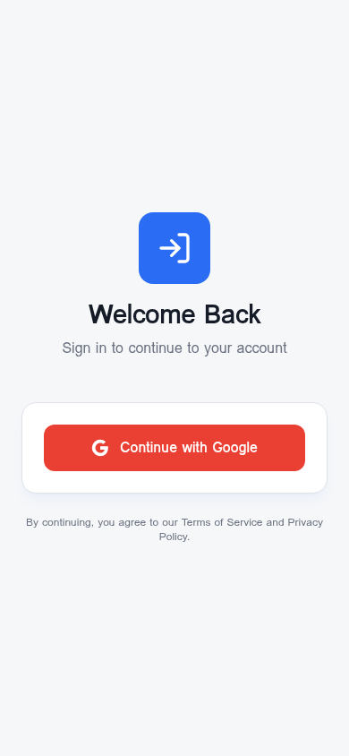

# Google Sign-In Native Test App

A test application to verify that Google Sign-In stays **within the app** (native dialog) and does not open an external browser window when wrapped in Capacitor.

## Screenshot

<p align="center">
  
</p>

## Purpose

This app exists to validate one thing: when packaged as a native mobile app using Capacitor, pressing "Continue with Google" triggers the **native Google Sign-In overlay** — not a redirect to an external browser.

## Tech Stack

- **React + TypeScript + Vite** — Frontend
- **Capacitor** — Native mobile wrapper (Android & iOS)
- **@codetrix-studio/capacitor-google-auth** — Native Google Sign-In plugin
- **Supabase** — Backend (auth & database)
- **Tailwind CSS + shadcn/ui** — Styling

## Setup

### 1. Install dependencies

```bash
npm install
```

### 2. Google OAuth Credentials

1. Go to [Google Cloud Console → Credentials](https://console.cloud.google.com/apis/credentials)
2. Create OAuth 2.0 Client IDs for:
   - **Web** (used in `capacitor.config.ts` and `src/lib/google-auth.ts`)
   - **Android** (using your app's package name and SHA-1 signing key)
   - **iOS** (add reversed client ID as URL scheme)

### 3. Run on web (for development)

```bash
npm run dev
```

### 4. Build & run on Android

#### Prerequisites
- [Android Studio](https://developer.android.com/studio) installed
- Android SDK (installed via Android Studio)
- A physical Android device with USB debugging enabled, **or** an Android emulator
- Java 17+ (bundled with recent Android Studio versions)

#### Steps

```bash
# 1. Build the web app
npm run build

# 2. Add the Android platform (first time only)
npx cap add android

# 3. Sync web assets + plugins to the native project
npx cap sync android

# 4. Open in Android Studio
npx cap open android
```

Then in **Android Studio**:
1. Wait for Gradle sync to finish
2. Connect your phone via USB (or start an emulator)
3. Click the **Run ▶** button (or `Shift + F10`)
4. The app installs and launches on your device

> **Every time you change web code**, re-run:
> ```bash
> npm run build && npx cap sync android
> ```

#### Enable USB debugging on your phone
1. Go to **Settings → About phone**
2. Tap **Build number** 7 times to unlock Developer options
3. Go to **Settings → Developer options → USB debugging** → enable it
4. When you plug in your phone, tap **Allow** on the USB debugging prompt

### 5. Build & run on iOS

#### Prerequisites
- A Mac with [Xcode](https://apps.apple.com/app/xcode/id497799835) installed (v14+)
- CocoaPods (`sudo gem install cocoapods`)
- An Apple Developer account (free works for personal device testing)

#### Steps

```bash
# 1. Build the web app
npm run build

# 2. Add the iOS platform (first time only)
npx cap add ios

# 3. Sync web assets + plugins to the native project
npx cap sync ios

# 4. Open in Xcode
npx cap open ios
```

Then in **Xcode**:
1. Select your connected device (or a simulator) from the device dropdown
2. Set your **Signing Team** under the target's "Signing & Capabilities" tab
3. Click the **Run ▶** button (`Cmd + R`)

> For the Google Sign-In plugin on iOS, add your **reversed iOS client ID** as a URL scheme in `Info.plist`.

### 6. Common post-pull workflow

After every `git pull` or dependency change:

```bash
npm install
npm run build
npx cap sync          # syncs BOTH android and ios if present
```

## Expected Behavior

| Platform | What should happen on "Continue with Google" |
|----------|----------------------------------------------|
| Web (browser) | Standard Google OAuth popup/redirect |
| Android (Capacitor) | Native Google Sign-In bottom sheet (in-app) |
| iOS (Capacitor) | Native Google Sign-In dialog (in-app) |

**If an external browser opens instead**, it means the native plugin is not configured correctly (missing SHA-1, wrong client ID, or `npx cap sync` was not run).

## Troubleshooting

- Run `npx cap sync` after every `git pull` or dependency change
- Ensure your SHA-1 fingerprint matches the one registered in Google Cloud Console
- For debug builds: `keytool -list -v -keystore ~/.android/debug.keystore -alias androiddebugkey -storepass android`

## License

MIT
